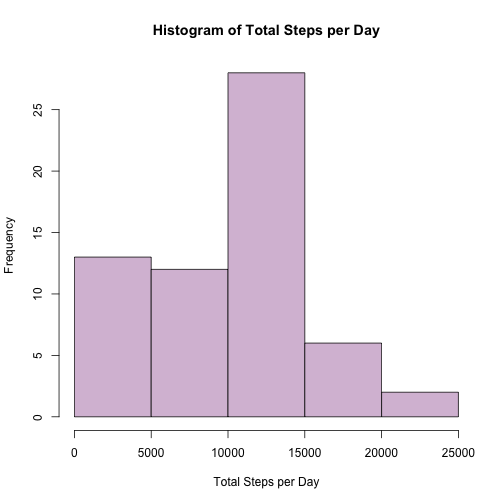
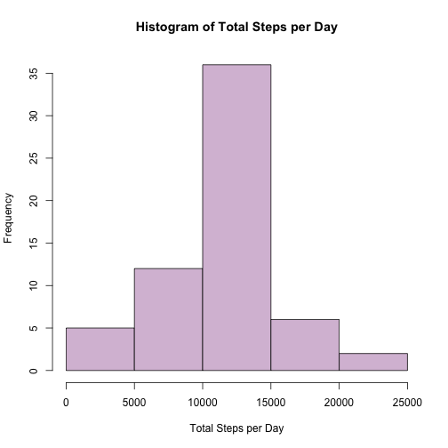
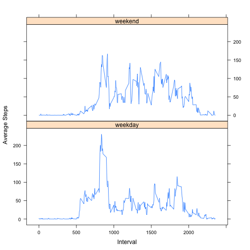

Programming Assigment 1
===========================================
Analysis of Daily Activity
===========================================
   
In this assignment we use data from a personal activity monitoring device that records the following paratemers to measure daily activity: 
  
* **steps**: Number of steps taking in a 5-minute interval (missing values are coded as NA)  
* **date**: The date on which the measurement was taken in YYYY-MM-DD format  
* **interval**: Identifier for the 5-minute interval in which measurement was taken.  

We've processed this raw data to produce summary statistics and plots to characterize daily activity.  

## Loading and preprocessing the data  

First we load the data from the given comma-separated-value (CSV) file. Then, the dates are converted to the appropriate format. The code for these steps is shown below:


```r
activityData <- read.csv("./activity.csv")
activityData$date <- as.Date(activityData$date)
```

## What is mean total number of steps taken per day? 

Next, we would like to get a basic idea of daily activity by looking at the number of steps taken each day. We can do this by:

1. Making a histogram of the total number of steps taken each day, using the code below:  


```r
TotalStepsPerDay <- tapply(activityData$steps, activityData$date, sum, na.rm=TRUE)
hist(TotalStepsPerDay,
     main = "Histogram of Total Steps per Day",
     xlab = "Total Steps per Day",
     col = "thistle")
```

 

2. Calculating the **mean** and **median** total number of steps taken per day, using the code below:  


```r
mean(TotalStepsPerDay, na.rm = TRUE)
```

```
## [1] 9354.23
```

```r
median(TotalStepsPerDay, na.rm = TRUE)
```

```
## [1] 10395
```

## What is the average daily activity pattern?

Next, we can examine the average daily activity pattern by:  

1. Making a time series plot of the 5-minute interval (x-axis) and the average number of steps taken, averaged across all days (y-axis), using the code below:


```r
MeanStepsPerInterval <- aggregate(steps ~ interval, data = activityData, FUN = mean, na.rm=TRUE)
plot(MeanStepsPerInterval$interval,
     MeanStepsPerInterval$steps, 
     type = "l",
     xlab = "Interval",
     ylab = "Average Steps")
```

 

2. Identifying the 5-minute interval, on average across all the days in the dataset, that contains the maximum number of steps:


```r
MeanStepsPerInterval[which(MeanStepsPerInterval$steps == max(MeanStepsPerInterval$steps)), 1]
```

```
## [1] 835
```

## Imputing missing values  

Note that all of the calculations so far do not take into account missing values in the data, and may therefore not be competely representative of the person's true daily activity. First, we check to see if any of the three measurements contain missing values:


```r
any(is.na(activityData$steps))
```

```
## [1] TRUE
```

```r
any(is.na(activityData$date))
```

```
## [1] FALSE
```

```r
any(is.na(activityData$interval))
```

```
## [1] FALSE
```

We've shown that only the **steps** variable contains missing values. To take these into account, we can substitute the missing values with the average steps value across all days for the corresponding interval. Assuming that the person follows the same routine each day (same activities at approximately the same time), this should give us a more accurate representation of the person's activity during the given time range. We can accomplish this by taking the following steps:  

1. Calculating the total number of missing values in the dataset (i.e. the total number of rows with NAs). We now know that only the **steps** variable has missing values, so we can count those as:  


```r
sum(is.na(activityData$steps))
```

```
## [1] 2304
```

2. Filling in all of the missing steps values in the dataset using the mean for that 5-minute interval, and then continuing to  

3. Create a new dataset that is equal to the original dataset but with the missing data filled in. We can create a new data set called *imputeActivity* that contains the average number of steps for each interval  on each day (calculated previously), and sort that data set by date to match the original data set:  


```r
imputeActivity <- merge(activityData[, 2:3], MeanStepsPerInterval)
imputeActivity <- imputeActivity[with(imputeActivity, order(date, interval)), ]
```

Next, we will use the non-NA steps values from the original data set to replace the average values in the new dataset where data from the old set is available. The resuling data set contains the original data and the average steps for that 5-minute interval in place of missing values.  


```r
imputeActivity$steps[!is.na(activityData$steps)] <- activityData$steps[!is.na(activityData$steps)]
```

4. Lastly, we can again make a histogram of the total number of steps taken each day and calculate the mean and median total number of steps taken per day:  


```r
TotalImputedStepsPerDay <- tapply(imputeActivity$steps, imputeActivity$date, sum)
hist(TotalImputedStepsPerDay,
     main = "Histogram of Total Steps per Day",
     xlab = "Total Steps per Day",
     col = "thistle")
```

 

```r
mean(TotalImputedStepsPerDay)
```

```
## [1] 10766.19
```

```r
median(TotalImputedStepsPerDay)
```

```
## [1] 10766.19
```

We can see that these values differ from the estimates from the first part of the assignment. Imputing the missing data **increased** the mean and median total steps per day. This is not surprising, since imputing the missing values has taken into account any additional activity performed during the time when data was not recorded.

## Are there differences in activity patterns between weekdays and weekends?

Finally, let's compare activity patterns on weekdays vs. weekends. We can do this in two steps:  

1. Let's create a new factor variable in the dataset with two levels – “weekday” and “weekend” indicating whether a given date is a weekday or weekend day. We will add a new column named *week* to the data set containing the day of the week based on the date. Then, we will replace all days that are not Saturday nor Sunday with the label *weekday*, and all all days that are Saturday or Sunday with the label *weekend*:  


```r
imputeActivity$week <- weekdays(imputeActivity$date, abbreviate = TRUE)

imputeActivity$week[which(imputeActivity$week != "Sat" & imputeActivity$week != "Sun")] <- "weekday"
imputeActivity$week[which(imputeActivity$week == "Sat" | imputeActivity$week == "Sun")] <- "weekend"
```

2. We can make a panel plot containing a time series of the 5-minute interval (x-axis) and the average number of steps taken, averaged across all weekday days or weekend days (y-axis). First, we need to calulate the average number of steps per interval, and then we can construct the panel plot using the *week* labels we created in step 1:


```r
MeanImputedStepsPerInterval <- aggregate(imputeActivity$steps,
                                         list(imputeActivity$interval,
                                              imputeActivity$week),
                                         mean)
colnames(MeanImputedStepsPerInterval) <- c("interval", "week", "steps")

library(lattice)
xyplot(steps ~ interval | week, data = MeanImputedStepsPerInterval,
      layout = c(1, 2),
      type = "l",
      xlab = "Interval",
      ylab = "Average Steps")
```

 
